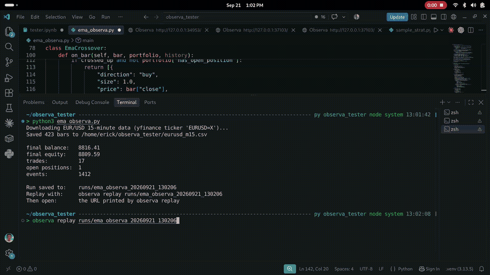

# Observa

**Backtest a trading strategy — then see what actually happened.**

Most backtesting tools give you the final result.

Profit. Win rate. Drawdown. Sharpe ratio.

Observa lets you go further and **replay the backtest bar by bar** so you can
see what the strategy was looking at, when it entered, where it filled, how the
trade developed, and how it eventually closed.

Think of it like a debugger for a trading strategy.



*Real EUR/USD 15-minute data · EMA crossover strategy · replayed bar by bar*

### Watch the full demo

https://github.com/user-attachments/assets/2b842e4e-4985-446d-b587-7644fafa6465

---

## Why Observa?

Suppose your backtest says:

> 11 trades.
> Positive return.
> Acceptable drawdown.

That still leaves some important questions.

- Why did this trade open?
- What was the strategy seeing at the time?
- What price did the order actually fill at?
- Did spread or slippage change the trade?
- Why was an order rejected?
- Did a stop or target trigger where you expected?
- What caused the trade to close?
- Does the strategy still make sense when you actually watch it trade?

Observa saves what happened during the backtest so you can go back and inspect
it instead of relying only on the final statistics.

---

## See a backtest in action

The easiest way to understand Observa is to run the included EUR/USD example.

It uses a simple EMA crossover strategy on a fixed sample of real EUR/USD
15-minute market data.

The strategy is deliberately simple:

- when the fast EMA crosses above the slow EMA → **buy**
- when it crosses back below → **close**
- spread, slippage and commission are included in the backtest
- the EMA lines and trade markers are shown in the replay

The point of the example is not to demonstrate a profitable strategy.

It is to show you exactly what Observa lets you inspect.

---

## Install Observa

> **Important:** do not run `pip install observa`.
>
> The `observa` package currently published on PyPI is unrelated to this
> project.

The next Observa wheel will be published on the project's GitHub Releases page:

https://github.com/ErickNgumo/observa/releases

> **Note:** the current published wheel (0.1.4) predates the one-install setup
> and the bundled EUR/USD demo described here. The integrated one-install build
> is pending the next release — until then, the demo and one-install behaviour
> are available from source.

Once the wheel is published, install it with:

```bash
python -m pip install "<the wheel URL from that Releases page>"
```

That's the only installation you need.

The same installation includes:

- backtesting
- browser replay
- Python inspection
- strategy validation
- AI authoring support
- MCP support

You do not need Rust or Cargo to use Observa.

## Run the EUR/USD demo

The demo ships inside the package, so it needs no data download, no internet
connection and no extra libraries.

```bash
python examples/eurusd_demo.py
```

`examples/eurusd_demo.py` is also attached to the GitHub Release. It saves the
run to `runs/eurusd-demo`.

The same thing in Python:

```python
import observa
from observa.samples import EmaCrossover

data = observa.demo_data_path()          # bundled real EUR/USD, works offline

result = observa.run(
    EmaCrossover(),
    data,
    config=observa.Config(dataset_source=data, interval="15m"),
    output="runs/eurusd-demo",
)

print(result.summary())
```

## Replay it

```bash
observa replay runs/eurusd-demo
```

Open the local URL printed in the terminal. You can step through the backtest
bar by bar and see:

- market candles
- the fast and slow EMA
- what the strategy decided on each bar
- entries and exits
- trade markers on the chart
- account state
- the trade history
- the final performance metrics

## What is Observa doing during the backtest?

Your strategy decides what it *wants* to do. For example:

> "The fast EMA crossed above the slow EMA. Buy."

Observa handles how that decision is simulated:

- when the order can fill
- the fill price
- spread
- slippage
- commission
- stops and targets
- opening and closing positions
- profit and loss

It also records what happened so the run can be inspected afterwards.

That means the chart you replay later is showing the backtest that was actually
run — it is not running a second backtest in the browser.

## Write your own strategy

An Observa strategy is a Python class that receives each new bar and decides
what it wants to do.

```python
class MyStrategy:
    def initialize(self, params=None):
        self.previous = None

    def on_bar(self, bar, portfolio, history):
        price = bar["close"]
        crossed = self.previous is not None and price > self.previous
        self.previous = price

        if crossed and not portfolio["has_open_position"]:
            return [{
                "direction": "buy",
                "size": 1.0,
                "sl": round(price - 0.0040, 5),
                "reason": "close rose above the previous close",
            }]
        return []

    def teardown(self):
        pass
```

`reason` is optional, but it is useful because Observa can preserve it with the
decision. Later, when inspecting the backtest, you can see not only what the
strategy did but also the reason it gave at the time.

Full details, including how to close a position and how to draw on the chart:
[writing a strategy for Observa](docs/agent/strategy-authoring.md) ·
[strategy reference](docs/strategy-contract.md).

## Use AI to write an Observa strategy

You do not have to write every strategy by hand. For example, you could ask a
coding agent:

> Use Observa to create an RSI mean-reversion strategy. Buy when RSI falls
> below 30, close when it returns above 50, and include a reason with every
> decision.

Observa ships the things an AI needs to get this right, inside the installed
package:

- strategy instructions
- a working example
- a machine-readable description of the rules

so the agent learns the Observa strategy format instead of guessing.

Before running AI-written code, validate it:

```bash
observa validate-strategy strategy.py --smoke --json
```

> ⚠️ **Security:** strategy validation is not a sandbox. Validation imports
> strategy code, and smoke validation executes the strategy. Only validate code
> you trust.

## Inspect a saved backtest with Python

```python
import observa

run = observa.inspect_run("runs/eurusd-demo")

run.trades()              # completed trades
run.positions(open=None)  # every position, or open=True / open=False
run.rejections()          # orders the engine rejected, and why
```

This is useful when you want to analyse the backtest programmatically instead
of using the browser replay. Reference:
[inspection & strategy API](docs/STRATEGY_API.md).

## Let an AI inspect Observa directly

Observa can also connect to AI tools through MCP.

**What is MCP?** MCP is a way for supported AI applications and coding agents to
connect to other software.

For Observa, that means an AI can ask Observa directly for information about
your saved backtests instead of you copying results into the chat manually.

Examples of what you can ask:

- Why did this trade close?
- Show me all rejected orders.
- What happened around this losing trade?
- Which order opened this position?
- How do I write an Observa strategy?

MCP is optional. You do **not** need it to run, replay or inspect a backtest
manually.

**Start Observa's MCP server.** MCP support is already included when you install
Observa:

```bash
observa mcp --runs-dir runs/
```

Your AI application still needs to be configured to launch that command as an
MCP server — start the server and the client configuration are two separate
steps:

```
Your AI tool
    │
    │ MCP
    ▼
  Observa
    │
    ▼
Saved backtests
```

Once connected, the AI can:

- learn how Observa strategies are written
- read the included strategy example and guide
- list saved backtests
- inspect trades, orders and positions
- inspect strategy decisions
- inspect rejected orders
- inspect metrics and run information

It cannot use MCP to run arbitrary strategy code or modify your saved runs.

Setup for specific applications: [connecting an AI to Observa](docs/MCP.md).

## Three ways to inspect the same backtest

| Way | Command or call | Best when |
| --- | --- | --- |
| Replay | `observa replay runs/eurusd-demo` | you want to *see* the strategy trade |
| Python | `observa.inspect_run("runs/eurusd-demo")` | you want to query or analyse the run programmatically |
| AI through MCP | `observa mcp --runs-dir runs/` | you want to ask natural-language questions about the saved run |

All three are looking at the same saved backtest.

## Trading costs and execution

Backtest results depend on how orders are simulated. Costs are applied to the
simulated trades themselves as they happen — not merely added to the final
statistics afterwards.

```python
config = observa.Config(
    fill_mode=observa.NEXT_BAR_OPEN,   # or observa.BAR_CLOSE
    spread=0.0002,
    slippage=0.0001,
    commission=7.0,                    # per round trip
    commission_mode=observa.ROUND_TRIP,
    interval="15m",
    dataset_source=data,
)
```

Assumptions, fill modes and cost handling in detail:
[execution model](docs/execution-model.md).

## Data

Observa works with supported OHLC market data:

- the bundled EUR/USD demo works offline
- you can supply your own CSV or list of bars

Format, requirements and the provenance of the bundled demo:
[data format](docs/data-format.md) · [demo dataset](docs/demo-dataset.md).

## What Observa is — and isn't

Observa is designed to help you run and inspect trading-strategy backtests.

It does not:

- create profitable strategies for you
- guarantee that a strategy is correct
- predict the market
- call an AI model by itself
- provide live trading
- remove the need to think carefully about your assumptions

AI can help you write and analyse strategies.

Observa gives that work a consistent place to run and something concrete to
inspect afterwards.

## Current status

Observa is currently an early tester build.

Verified environment:

- Linux x86_64
- CPython 3.10+
- glibc 2.34+

Windows, macOS and Google Colab are not currently runtime-verified.

Observa is not live-trading or production trading software.

See [known limitations](docs/known-limitations.md) and the
[current release notes](docs/mvp-release-notes.md).

## Examples

- [`examples/eurusd_demo.py`](examples/eurusd_demo.py) — real EUR/USD demo, fully offline.
- [`examples/agent_example.py`](examples/agent_example.py) — a complete, correct strategy to copy.
- [`examples/ai_starter/`](examples/ai_starter/) — starter project for a coding agent.
- [`examples/rsi_mean_reversion.py`](examples/rsi_mean_reversion.py) — RSI mean-reversion pattern.
- [`examples/quickstart.py`](examples/quickstart.py) — tiny deterministic sample.
- [`examples/ema_observa.py`](examples/ema_observa.py) — downloads live EUR/USD itself
  (needs `python -m pip install yfinance pandas`; **not** required for Observa).

Technical examples only — not financial advice.

## Documentation

Start here

- [Getting started](docs/getting-started.md)
- [Demo dataset](docs/demo-dataset.md)

Writing a strategy

- [Writing a strategy for Observa](docs/agent/strategy-authoring.md)
- [Strategy reference](docs/strategy-contract.md)

Using your own data

- [Data format](docs/data-format.md)

Inspecting backtests

- [Replay](docs/getting-started.md#3-replay-it)
- [Python inspection](docs/STRATEGY_API.md)
- [Connect an AI with MCP](docs/MCP.md)

Understanding the backtest

- [Execution, fills and trading costs](docs/execution-model.md)
- [Known limitations](docs/known-limitations.md)

Contributors / internals

- [Architecture](docs/ARCHITECTURE.md)

## Development

This section is for contributors, not normal Observa users.

Building Observa requires Rust, Cargo and Maturin:

```bash
python -m pip install maturin
cd python && maturin build --release   # wheel in python/target/wheels/
cargo test --workspace
```

Rust workspace under `crates/`, Python package under `python/`, replay frontend
under `python/python/observa/static/`. End users never need any of this.
