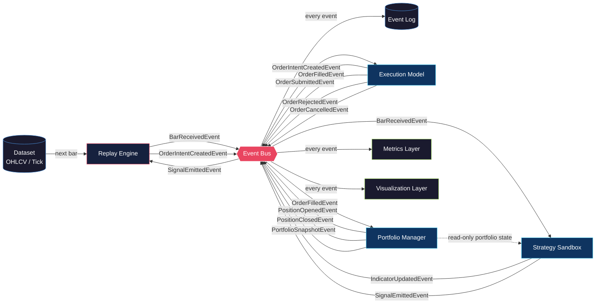

# Observa — Architecture Blueprint

> This document shows how a single bar flows through the system,
> from raw data to visual output. Every arrow is an event. Every
> box is an isolated component.

---

## Single Bar Flow



---

## Key Design Decision — Portfolio Visibility

The Strategy is allowed to *read* the current portfolio state — open
positions, direction, entry price — so it can make exit decisions.

It receives this as a **read-only snapshot** each bar, passed alongside
the market data. It can never mutate portfolio state directly.

```
Each bar, the Strategy receives:
  ├── Current Bar (OHLCV)
  ├── Its own private indicator state
  └── Read-only Portfolio snapshot
         ├── Open positions
         ├── Position direction (long / short)
         ├── Entry price
         └── Unrealised PnL
```

The exit flow works like this:

```
Strategy reads open position
  → emits ExitSignalEvent
  → Replay Engine creates OrderIntentCreatedEvent (close)
  → Execution Model processes it
  → OrderFilledEvent emitted
  → Portfolio Manager closes position
  → PositionClosedEvent emitted
  → Visualization renders exit marker
```

The Strategy **decides**. The Portfolio Manager **executes the result**.

---

## Component Responsibilities

| Component | Role | Emits | Receives |
|---|---|---|---|
| **Dataset** | Serves raw bar or tick data | — | — |
| **Replay Engine** | Controls time, drives the loop, converts signals to order intents | `BarReceivedEvent` `OrderIntentCreatedEvent` | `SignalEmittedEvent` |
| **Event Bus** | Routes all events to subscribers | — | Everything |
| **Strategy Sandbox** | Runs user logic, reads portfolio state, emits signals | `SignalEmittedEvent` `IndicatorUpdatedEvent` | `BarReceivedEvent` + read-only portfolio |
| **Execution Model** | Applies spread, slippage, commission, fill logic | `OrderSubmittedEvent` `OrderFilledEvent` `OrderRejectedEvent` `OrderCancelledEvent` | `OrderIntentCreatedEvent` |
| **Portfolio Manager** | Tracks capital, positions, PnL. Provides read-only view to Strategy | `PositionOpenedEvent` `PositionClosedEvent` `PortfolioSnapshotEvent` | `OrderFilledEvent` |
| **Metrics Layer** | Derives statistics from the event stream | — | All events |
| **Visualization Layer** | Renders chart, markers, indicators, equity curve | — | All events |
| **Event Log** | Persists every event immutably | — | All events |

---

## The Four Hard Rules

1. **The Strategy never places orders directly.**
   It emits signals. The Replay Engine creates intents.

2. **The Visualization Layer computes nothing.**
   It only reacts to events. All truth lives in the event log.

3. **The Execution Model is the only place realism is applied.**
   Spread, slippage, and commission live here and nowhere else.

4. **Every state change emits an event.**
   If it didn't emit an event, it didn't happen.

---

*This diagram reflects the MVP architecture. Components are designed
to be extended without modifying each other.*