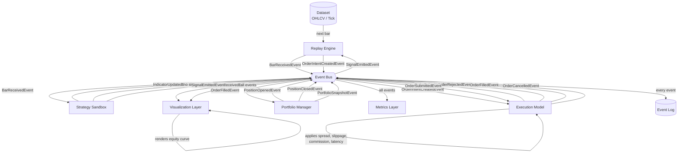

# Observa — Architecture Blueprint

> This document shows how a single bar flows through the system,
> from raw data to visual output. Every arrow is an event. Every
> box is an isolated component.

---

## Single Bar Flow



---

## Component Responsibilities

| Component | Role | Emits | Receives |
|---|---|---|---|
| **Dataset** | Serves raw bar or tick data | — | — |
| **Replay Engine** | Controls time, drives the loop, creates order intents | `BarReceivedEvent` `OrderIntentCreatedEvent` | `SignalEmittedEvent` |
| **Event Bus** | Routes all events to subscribers | — | Everything |
| **Strategy Sandbox** | Runs user logic, emits signals and indicators | `SignalEmittedEvent` `IndicatorUpdatedEvent` | `BarReceivedEvent` |
| **Execution Model** | Applies realism between intent and fill | `OrderSubmittedEvent` `OrderFilledEvent` `OrderRejectedEvent` `OrderCancelledEvent` | `OrderIntentCreatedEvent` |
| **Portfolio Manager** | Tracks capital, positions, and PnL | `PositionOpenedEvent` `PositionClosedEvent` `PortfolioSnapshotEvent` | `OrderFilledEvent` |
| **Metrics Layer** | Derives statistics from events | — | All events |
| **Visualization Layer** | Renders chart, markers, indicators | — | All events |
| **Event Log** | Persists every event immutably | — | All events |

---

## The Four Hard Rules

These rules cannot be broken without breaking the architecture.

1. **The Strategy never places orders directly.**
   It emits signals. The Replay Engine creates intents.

2. **The Visualization Layer computes nothing.**
   It only reacts to events. All truth lives in the event log.

3. **The Execution Model is the only place realism is applied.**
   Spread, slippage, and commission live here and nowhere else.

4. **Every state change emits an event.**
   If it didn't emit an event, it didn't happen.

---

*This diagram reflects the MVP architecture. Components are designed
to be extended without modifying each other.*
```